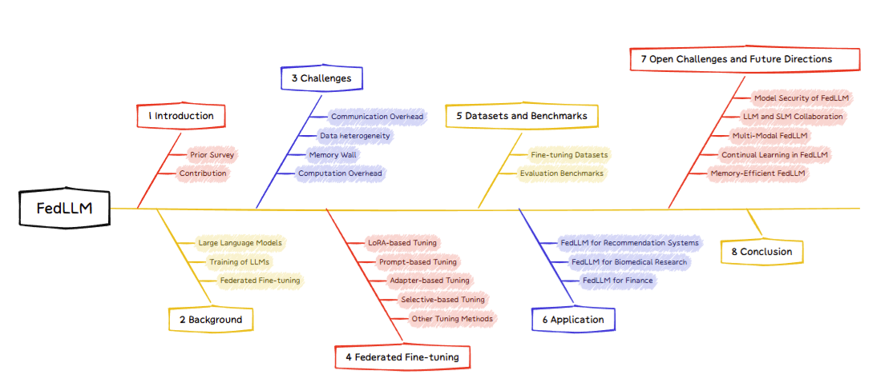
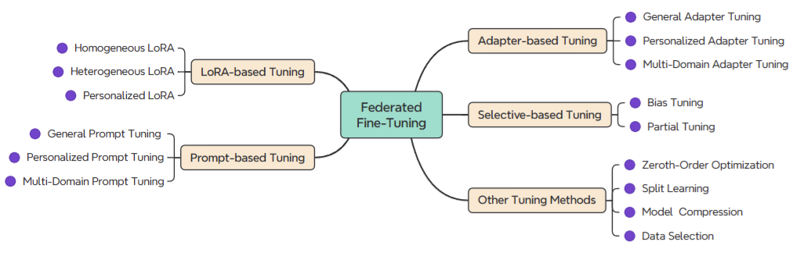

# Awesome-Federated-LLM-Learning
[]()

<!-- omit in toc -->
## 📢 Updates

We released a survey paper "[A Survey on Federated Fine-tuning of Large Language Models](https://arxiv.org/pdf/2503.12016)". Feel free to cite or open pull requests.

⚠️ NOTE: If there is any missing or new relevant literature, please feel free to submit an issue. we will update the Github and Arxiv papers regularly. 😊

<!-- omit in toc -->
## 👀 Overall Structure


<!-- omit in toc -->
## 📒 Table of Contents

- [Awesome-Federated-LLM-Learning](#awesome-federated-llm-learning)
  - [Part 1: LoRA-based Tuning](#part-1-lora-based-tuning)
    - [1.1 Homogeneous LoRA](#11-homogeneous-lora)
    - [1.2 Heterogeneous LoRA](#12-heterogeneous-lora)
    - [1.3 Personalized LoRA](#13-personalized-lora)
  - [Part 2: Prompt-based Tuning](#part-2-prompt-based-tuning)
    - [2.1 General Prompt Tuning](#21-general-prompt-tuning)
    - [2.2 Personalized Prompt Tuning](#22-personalized-prompt-tuning)
    - [2.3 Multi-domain Prompt Tuning](#23-multi-domain-prompt-tuning)
  - [Part 3: Adapter-based Tuning](#part-3-adapter-based-tuning)
    - [3.1 General Adapter Tuning](#31-general-adapter-tuning)
    - [3.2 Personalized Adapter Tuning](#32-personalized-adapter-tuning)
    - [3.3 Multi-domain Adapter Tuning](#33-multi-domain-adapter-tuning)
  - [Part 4: Selective-based Tuning](#part-4-selective-based-tuning)
    - [4.1 Bias Tuning](#41-bias-tuning)
    - [4.2 Partial Tuning](#42-partial-tuning)
  - [Part 5: Other Tuning Methods](#part-5-other-tuning-methods)
    - [5.1 Zero-Order Optimization](#51-zero-order-optimization)
    - [5.2 Split Learning](#52-split-learning)
    - [5.3 Model Compression](#53-model-compression)
    - [5.4 Data Selection](#54-data-selection)
- [Datasets and Benchmarks](#datasets-and-benchmarks)
  - [Prompt-tuning Datasets](#prompt-tuning-datasets)
    - [Domain: General](#domain-general)
    - [Domain: Finance](#domain-finance)
    - [Domain: Medicine](#domain-medicine)
    - [Domain: Code](#domain-code)
    - [Domain: Math](#domain-math)
    - [Domain: Law](#domain-law)
  - [Evaluation Benchmarks](#evaluation-benchmarks)
    - [Domain: General](#domain-general-1)
    - [Domain: Finance](#domain-finance-1)
    - [Domain: Medicine](#domain-medicine-1)
    - [Domain: Code](#domain-code-1)
    - [Domain: Math](#domain-math-1)
    - [Domain: Law](#domain-law-1)


## Part 1: LoRA-based Tuning

### 1.1 Homogeneous LoRA
* Fedra: A random allocation strategy for federated tuning to unleash the power of heterogeneous clients. [[Paper]](https://arxiv.org/abs/2311.11227) 
* Towards building the federatedGPT: Federated instruction tuning.[[Paper]](https://arxiv.org/abs/2305.05644)
* Communication-Efficient and Tensorized Federated Fine-Tuning of Large Language Models. [[Paper]](https://arxiv.org/abs/2410.13097)
* Selective Aggregation for Low-Rank Adaptation in Federated Learning. [[Paper]](https://arxiv.org/abs/2410.01463) 
* Federa: Efficient fine-tuning of language models in federated learning leveraging weight decomposition. [[Paper]](https://arxiv.org/abs/2404.18848)
* LoRA-FAIR: Federated LoRA Fine-Tuning with Aggregation and Initialization Refinement. [[Paper]](https://arxiv.org/abs/2411.14961)
* Federated LoRA with Sparse Communication. [[Paper]](https://arxiv.org/abs/2406.05233)
* SA-FedLora: Adaptive Parameter Allocation for Efficient Federated Learning with LoRA Tuning. [[Paper]](https://arxiv.org/abs/2405.09394)
* SLoRA: Federated parameter efficient fine-tuning of language models. [[Paper]](https://arxiv.org/abs/2308.06522)
* FederatedScope-LLM: A Comprehensive Package for Fine-tuning Large Language Models in Federated Learning [[Paper]](https://arxiv.org/abs/2309.00363)
* Robust Federated Finetuning of Foundation Models via Alternating Minimization of LoRA. [[Paper]](https://www.arxiv.org/abs/2409.02346)
* Automated federated pipeline for parameter-efficient fine-tuning of large language models. [[Paper]](https://arxiv.org/abs/2404.06448)
* Low-Parameter Federated Learning with Large Language Models. [[Paper]](https://arxiv.org/abs/2307.13896)
* Towards Robust and Efficient Federated Low-Rank Adaptation with Heterogeneous Clients. [[Paper]]()
* FedRA: A Random Allocation Strategy for Federated Tuning to Unleash the Power of Heterogeneous Clients. [[Paper]](https://arxiv.org/abs/2410.22815)
* Fed-piLot: Optimizing LoRA Assignment for Efficient Federated Foundation Model Fine-Tuning. [[Paper]](https://arxiv.org/abs/2410.10200)

### 1.2 Heterogeneous LoRA
* Heterogeneous lora for federated fine-tuning of on-device foundation models. [[Paper]](https://arxiv.org/abs/2401.06432)
* Flora: Federated fine-tuning large language models with heterogeneous low-rank adaptations. [[Paper]](https://arxiv.org/abs/2409.05976)
* Federated fine-tuning of large language models under heterogeneous tasks and client resources. [[Paper]](https://arxiv.org/abs/2402.11505)
* Federated LLMs Fine-tuned with Adaptive Importance-Aware LoRA. [[Paper]](https://arxiv.org/abs/2411.06581)
* Towards Federated Low-Rank Adaptation of Language Models with Rank Heterogeneity. [[Paper]](https://arxiv.org/abs/2406.17477)
* Fedhm: Efficient federated learning for heterogeneous models via low-rank factorization. [[Paper]](https://arxiv.org/abs/2111.14655)
* RBLA: Rank-Based-LoRA-Aggregation for Fine-Tuning Heterogeneous Models. [[Paper]](https://arxiv.org/abs/2408.08699)
  
### 1.3 Personalized LoRA
* FDLoRA: Personalized Federated Learning of Large Language Model via Dual LoRA Tuning. [[Paper]](https://arxiv.org/abs/2406.07925)
* Fedlora: Model-heterogeneous personalized federated learning with lora tuning. [[Paper]](https://arxiv.org/abs/2310.13283)
* FedLoRA: When Personalized Federated Learning Meets Low-Rank Adaptation. [[Paper]](https://openreview.net/forum?id=bZh06ptG9r)
* Dual-Personalizing Adapter for Federated Foundation Models. [[Paper]](https://arxiv.org/abs/2403.19211)
* Personalized Federated Instruction Tuning via Neural Architecture Search. [[Paper]](https://arxiv.org/abs/2402.16919)
* Communication-Efficient Personalized Federated Learning for Speech-to-Text Tasks. [[Paper]](https://arxiv.org/abs/2401.10070)
* Personalized Federated Fine-Tuning for LLMs via Data-Driven Heterogeneous Model Architectures. [[Paper]](https://arxiv.org/abs/2411.19128)

## Part 2: Prompt-based Tuning
### 2.1 General Prompt Tuning
* Prompt federated learning for weather forecasting: Toward foundation models on meteorological data. [[Paper]](https://arxiv.org/abs/2301.09152)
* Promptfl: Let federated participants cooperatively learn prompts instead of models-federated learning in age of foundation model. [[Paper]](https://arxiv.org/abs/2208.11625)
* Fedbpt: Efficient federated black-box prompt tuning for large language models. [[Paper]](https://arxiv.org/abs/2310.01467)
* Federated learning of large language models with parameter-efficient prompt tuning and adaptive optimization. [[Paper]](https://arxiv.org/abs/2310.15080)
* Efficient federated prompt tuning for black-box large pre-trained models. [[Paper]](https://arxiv.org/abs/2310.03123)
* Text-driven prompt generation for vision-language models in federated learning. [[Paper]](https://arxiv.org/abs/2310.06123)
* Learning federated visual prompt in null space for mri reconstruction. [[Paper]](https://arxiv.org/abs/2303.16181)
* Fed-cprompt: Contrastive prompt for rehearsal-free federated continual learning. [[Paper]](https://arxiv.org/abs/2307.04869)
* Fedprompt: Communication-efficient and privacy-preserving prompt tuning in federated learning. [[Paper]](https://arxiv.org/abs/2208.12268)
* Tunable soft prompts are messengers in federated learning. [[Paper]](https://arxiv.org/abs/2311.06805)
* Hepco: Data-free heterogeneous prompt consolidation for continual federated learning. [[Paper]](https://openreview.net/forum?id=dsWg7n6zoo)
* Prompt-enhanced Federated Learning for Aspect-Based Sentiment Analysis. [[Paper]](https://www.computer.org/csdl/proceedings-article/icicce/2023/956100a081/1WAIBqJhwpG)
* Towards practical few-shot federated nlp. [[Paper]](https://arxiv.org/abs/2212.00192)
* Federated prompting and chain-of-thought reasoning for improving llms answering. [[Paper]](https://arxiv.org/abs/2304.13911)
* FedHPL: Efficient Heterogeneous Federated Learning with Prompt Tuning and Logit Distillation. [[Paper]](https://arxiv.org/abs/2405.17267)
* Probabilistic Federated Prompt-Tuning with Non-IID and Imbalanced Data. [[Paper]](https://arxiv.org/abs/2502.19752)
* Federated Class-Incremental Learning with Prompting. [[Paper]](https://arxiv.org/abs/2310.08948)
* Explore and Cure: Unveiling Sample Effectiveness with Context-Aware Federated Prompt Tuning. [[Paper]](https://www.computer.org/csdl/journal/tm/2024/12/10629177/1ZdiYS9RJxC)
* Federated Prompt Learning for Weather Foundation Models on Devices. [[Paper]](https://arxiv.org/abs/2305.14244)

### 2.2 Personalized Prompt Tuning
* Efficient model personalization in federated learning via client-specific prompt generation. [[Paper]](https://arxiv.org/abs/2308.15367)
* Unlocking the potential of prompt-tuning in bridging generalized and personalized federated learning. [[Paper]](https://arxiv.org/abs/2310.18285)
* Pfedprompt: Learning personalized prompt for vision-language models in federated learning. [[Paper]](https://dl.acm.org/doi/10.1145/3543507.3583518)
* Global and local prompts cooperation via optimal transport for federated learning. [[Paper]](https://arxiv.org/abs/2403.00041)
* Visual prompt based personalized federated learning. [[Paper]](https://arxiv.org/abs/2303.08678)
* Personalized federated continual learning via multi-granularity prompt. [[Paper]](https://arxiv.org/abs/2407.00113)
* FedLPPA: Learning Personalized Prompt and Aggregation for Federated Weakly-supervised Medical Image Segmentation. [[Paper]](https://arxiv.org/abs/2402.17502)
* Harmonizing Generalization and Personalization in Federated Prompt Learning. [[Paper]](https://arxiv.org/abs/2405.09771)
* Tackling Feature-Classifier Mismatch in Federated Learning via Prompt-Driven Feature Transformation. [[Paper]](https://arxiv.org/abs/2407.16139)
* Personalized Federated Learning for Text Classification with Gradient-Free Prompt Tuning. [[Paper]](https://aclanthology.org/2024.findings-naacl.286.pdf)
* Mixture of Experts Made Personalized: Federated Prompt Learning for Vision-Language Models. [[Paper]](https://openreview.net/forum?id=xiDJaTim3P)
* CP 2 GFed: Cross-granular and Personalized Prompt-based Green Federated Tuning for Giant Models. [[Paper]](https://ieeexplore.ieee.org/document/10682866/)
  
### 2.3 Multi-domain Prompt Tuning
* DiPrompT: Disentangled Prompt Tuning for Multiple Latent Domain Generalization in Federated Learning. [[Paper]](https://arxiv.org/abs/2403.08506)
* Prompt-enhanced Federated Content Representation Learning for Cross-domain Recommendation. [[Paper]](https://arxiv.org/abs/2401.14678)
* Dual prompt tuning for domain-aware federated learning. [[Paper]](https://openreview.net/forum?id=pVaMBfI2eR)
* Federated adaptive prompt tuning for multi-domain collaborative learning. [[Paper]](https://arxiv.org/abs/2211.07864)
* Breaking physical and linguistic borders: Multilingual federated prompt tuning for low-resource languages. [[Paper]](https://openreview.net/forum?id=zzqn5G9fjn)
* Federated Domain Generalization via Prompt Learning and Aggregation. [[Paper]](https://arxiv.org/abs/2411.10063)
* CP-Prompt: Composition-Based Cross-modal Prompting for Domain-Incremental Continual Learning. [[Paper]](https://arxiv.org/abs/2407.21043)

## Part 3: Adapter-based Tuning
### 3.1 General Adapter Tuning
* Efficient federated learning for modern nlp. [[Paper]](https://arxiv.org/abs/2205.10162)
* Efficient federated learning with pre-trained large language model using several adapter mechanisms. [[Paper]](https://www.mdpi.com/2227-7390/11/21/4479)
  
### 3.2 Personalized Adapter Tuning
* Client-customized adaptation for parameter-efficient federated learning. [[Paper]](https://aclanthology.org/2023.findings-acl.75/)
* Fedclip: Fast generalization and personalization for clip in federated learning. [[Paper]](https://arxiv.org/abs/2302.13485)

### 3.3 Multi-domain Adapter Tuning
* Communication efficient federated learning for multilingual neural machine translation with adapter. [[Paper]](https://arxiv.org/abs/2305.12449)
* Adapter-based Selective Knowledge Distillation for Federated Multi-domain Meeting Summarization. [[Paper]](https://arxiv.org/abs/2308.03275)
* Feddat: An approach for foundation model finetuning in multi-modal heterogeneous federated learning. [[Paper]](https://arxiv.org/abs/2308.12305)

## Part 4: Selective-based Tuning
  
### 4.1 Bias Tuning
* Differentially private bias-term only fine-tuning of foundation models. [[Paper]](https://arxiv.org/abs/2210.00036)
* Conquering the communication constraints to enable large pre-trained models in federated learning. [[Paper]](https://arxiv.org/html/2210.01708v3)

### 4.2 Partial Tuning
* Bridging the gap between foundation models and heterogeneous federated learning. [[Paper]](https://arxiv.org/abs/2310.00247)
* Exploring Selective Layer Fine-Tuning in Federated Learning. [[Paper]](https://openreview.net/forum?id=eu1PIDPYwC)
  
## Part 5: Other Tuning Methods

### 5.1 Zero-Order Optimization
* Federated full-parameter tuning of billion-sized language models with communication cost under 18 kilobytes. [[Paper]](https://arxiv.org/abs/2312.06353)
* $\{$FwdLLM$\}$: Efficient Federated Finetuning of Large Language Models with Perturbed Inferences. [[Paper]](https://www.usenix.org/conference/atc24/presentation/xu-mengwei)
* ZooPFL: Exploring black-box foundation models for personalized federated learning. [[Paper]](https://arxiv.org/abs/2310.05143)
* On the convergence of zeroth-order federated tuning for large language models. [[Paper]](https://arxiv.org/abs/2402.05926)
* Thinking Forward: Memory-Efficient Federated Finetuning of Language Models. [[Paper]](https://arxiv.org/abs/2405.15551)
* Communication-Efficient Byzantine-Resilient Federated Zero-Order Optimization. [[Paper]](https://arxiv.org/abs/2406.14362)


### 5.2 Split Learning
* FedBERT: When federated learning meets pre-training. [[Paper]](https://dl.acm.org/doi/10.1145/3510033)
* Federated split bert for heterogeneous text classification. [[Paper]](https://arxiv.org/abs/2205.13299)
* FedSplitX: Federated Split Learning for Computationally-Constrained Heterogeneous Clients. [[Paper]](https://arxiv.org/abs/2310.14579)
  
### 5.3 Model Compression
* Fedbiot: Llm local fine-tuning in federated learning without full model. [[Paper]](https://arxiv.org/abs/2406.17706)
  
### 5.4 Data Selection
* Federated Data-Efficient Instruction Tuning for Large Language Models. [[Paper]](https://arxiv.org/abs/2410.10926)


# Datasets and Benchmarks

## Prompt-tuning Datasets

### Domain: General

| Dataset | Language | Construction Method | Description |
| ------------------------------- | ----------------- | ----------------------- | -------------------------------------------------------------------------------------------- |
| Alpaca [\[paper\]](https://crfm.stanford.edu/2023/03/13/alpaca.html) [\[github\]](https://github.com/tatsu-lab/stanford_alpaca) [\[huggingface\]](https://huggingface.co/datasets/tatsu-lab/alpaca_farm) | English | Model Construct | Generated by Text-Davinci-003 with Alpaca-style instruction prompts. |
| Alpaca-GPT4 [\[paper\]](https://arxiv.org/abs/2304.03277) [\[github\]](https://github.com/Instruction-Tuning-with-GPT-4/GPT-4-LLM) [\[huggingface\]](https://huggingface.co/datasets/vicgalle/alpaca-gpt4) | English | Model Construct | Generated by GPT-4 based on Alpaca prompts with richer multi-turn instructions. |
| Self-Instruct [\[paper\]](https://arxiv.org/abs/2212.10560) [\[github\]](https://github.com/yizhongw/self-instruct) [\[huggingface\]](https://huggingface.co/datasets/yizhongw/self_instruct) | English | Human + Model Construct | Seed instructions expanded by GPT-3 to improve model generalization. |
| UltraChat 200k [\[paper\]](https://arxiv.org/abs/2305.14233) [\[github\]](https://github.com/thunlp/UltraChat) [\[huggingface\]](https://huggingface.co/datasets/HuggingFaceH4/ultrachat_200k) | English | Model Construct | High-quality multi-turn dialogue subset filtered from UltraChat. |
| OpenOrca [\[paper\]](https://arxiv.org/abs/2306.01390) [\[github\]](https://github.com/OpenOrca/OpenOrca) [\[huggingface\]](https://huggingface.co/datasets/Open-Orca/OpenOrca) | English | Model Construct | ~4.2 M GPT-3.5/4-augmented FLAN examples for instruction following. |
| ShareGPT90K [\[github\]](https://github.com/lm-sys/FastChat) [\[huggingface\]](https://huggingface.co/datasets/anon8231489123/ShareGPT_Vicuna_unfiltered) | English | Model Construct | 90 K multi-turn dialogues extracted from ShareGPT. |
| WizardLM Evol-Instruct V2 196k [\[paper\]](https://arxiv.org/abs/2304.07195) [\[github\]](https://github.com/nlpxucan/WizardLM) [\[huggingface\]](https://huggingface.co/datasets/WizardLMTeam/WizardLM_evol_instruct_V2_196k) | English | Model Construct | 196 K examples generated via Evol-Instruct. |
| Databricks Dolly 15K [\[paper\]](https://www.databricks.com/blog/2023/04/12/dolly-open-source-instruction-following-llm.html) [\[github\]](https://github.com/databrickslabs/dolly) [\[huggingface\]](https://huggingface.co/datasets/databricks/databricks-dolly-15k) | English | Human Construct | 15 K human-written prompt-response pairs across diverse tasks. |
| Baize [\[paper\]](https://arxiv.org/abs/2304.01196) [\[github\]](https://github.com/project-baize/baize-chatbot) [\[huggingface\]](https://huggingface.co/datasets/linkanjarad/baize-chat-data) | English | Model Construct | Instruction-following dialogues generated via ChatGPT self-chat. |
| OpenChat [\[paper\]](https://arxiv.org/abs/2309.11235) [\[github\]](https://github.com/imoneoi/openchat) [\[huggingface\]](https://huggingface.co/datasets/openchat/ultrachat-sharegpt) | English | Model Construct | Mixed-quality data alignment using C-RLFT for open LLMs. |
| Flan-v2 [\[paper\]](https://arxiv.org/abs/2301.13688) [\[github\]](https://github.com/google-research/FLAN) [\[huggingface\]](https://huggingface.co/datasets/SirNeural/flan_v2) | English | Model Construct | Aggregates Flan, P3, Super-Natural Instructions, CoT, Dialog tasks. |
| BELLE-train-0.5M-CN [\[paper\]](https://arxiv.org/abs/2305.20050) [\[github\]](https://github.com/LianjiaTech/BELLE) [\[huggingface\]](https://huggingface.co/datasets/BelleGroup/train_0.5M_CN) | Chinese | Human + Model Construct | 519 K Chinese instruction-following examples. |
| BELLE-train-1M-CN [\[paper\]](https://arxiv.org/abs/2305.20050) [\[github\]](https://github.com/LianjiaTech/BELLE) [\[huggingface\]](https://huggingface.co/datasets/BelleGroup/train_1M_CN) | Chinese | Human + Model Construct | 917 K Chinese instruction samples. |
| BELLE-train-2M-CN [\[paper\]](https://arxiv.org/abs/2305.20050) [\[github\]](https://github.com/LianjiaTech/BELLE) [\[huggingface\]](https://huggingface.co/datasets/BelleGroup/train_2M_CN) | Chinese | Human + Model Construct | 2 M Chinese instruction samples. |
| Firefly-train-1.1M [\[paper\]](https://arxiv.org/abs/2309.09219) [\[github\]](https://github.com/yangjianxin1/Firefly) [\[huggingface\]](https://huggingface.co/datasets/YeungNLP/firefly-train-1.1M) | Chinese | Human Construct | 1.65 M Chinese samples across 23 tasks with human templates. |
| Wizard-LM-Chinese-instruct-evol [\[paper\]](https://arxiv.org/abs/2304.07195) [\[github\]](https://github.com/silk-road/Wizard-LM-Chinese-instruct-evol) [\[huggingface\]](https://huggingface.co/datasets/silk-road/Wizard-LM-Chinese-instruct-evol) | Chinese | Human + Model Construct | 70 K WizardLM instructions translated into Chinese. |
| HC3-Chinese [\[paper\]](https://arxiv.org/abs/2301.07597) [\[github\]](https://github.com/Hello-SimpleAI/chatgpt-comparison-detection) [\[huggingface\]](https://huggingface.co/datasets/Hello-SimpleAI/HC3-Chinese) | Chinese | Human + Model Construct | Human-ChatGPT QA pairs in Chinese. |
| HC3 [\[paper\]](https://arxiv.org/abs/2301.07597) [\[github\]](https://github.com/Hello-SimpleAI/chatgpt-comparison-detection) [\[huggingface\]](https://huggingface.co/datasets/Hello-SimpleAI/HC3) | English / Chinese | Human + Model Construct | Bilingual Human-ChatGPT QA pairs. |
| ShareGPT-Chinese-English-90k [\[github\]](https://github.com/lm-sys/FastChat) [\[huggingface\]](https://huggingface.co/datasets/anon8231489123/ShareGPT_Vicuna_unfiltered) | English / Chinese | Model Construct | 90 K bilingual user queries from ShareGPT logs. |


### Domain: Finance

| Dataset | Language | Construction Method | Description |
| ---------------------------------- | ------------ | ----------------------- | -------------------------------------------------------------------------------------------- |
| FinGPT [\[paper\]](https://arxiv.org/abs/2310.04793) [\[github\]](https://github.com/AI4Finance-Foundation/FinGPT) [\[huggingface\]](https://huggingface.co/datasets/FinGPT/fingpt-finred) | English | Human + Model Construct | Instruction-tuning data for diverse financial tasks. |
| Finance-Instruct-500k [\[paper\]](https://arxiv.org/abs/2503.16252) [\[github\]](https://github.com/SUFE-AIFLM-Lab/Fin-R1) [\[huggingface\]](https://huggingface.co/datasets/Josephgflowers/Finance-Instruct-500k) | English | Human + Model Construct | Large-scale (500 K) instruction dataset for finance reasoning. |
| Finance-Alpaca [\[github\]](https://github.com/gaurangbharti1/wealth-alpaca) [\[huggingface\]](https://huggingface.co/datasets/gbharti/finance-alpaca) | English | Human + Model Construct | Alpaca-style instructions combined with FiQA and custom Q&A. |
| Financial PhraseBank [\[paper\]](https://arxiv.org/abs/1307.5336) [\[github\]](https://github.com/vrunm/Text-Classification-Financial-Phrase-Bank) [\[huggingface\]](https://huggingface.co/datasets/takala/financial_phrasebank) | English | Human Construct | Manually annotated news sentences for sentiment classification. |
| Yahoo-Finance-Data [\[huggingface\]](https://huggingface.co/datasets/bwzheng2010/yahoo-finance-data) | English | Human Construct | Historical prices and fundamentals scraped from Yahoo Finance. |
| Financial-QA-10K [\[github\]](https://github.com/srmadani/financial-qa-rag) [\[huggingface\]](https://huggingface.co/datasets/virattt/financial-qa-10K) | English | Model Construct | 10 K contextual QA pairs generated from SEC 10-K filings. |
| Financial-Classification [\[huggingface\]](https://huggingface.co/datasets/nickmuchi/financial-classification) | English | Human Construct | Merged Financial PhraseBank + Kaggle texts for sentiment/topic classification. |
| Twitter-Financial-News-Topic [\[github\]](https://github.com/AliAramideh/Financial-Analysis-on-Twitter) [\[huggingface\]](https://huggingface.co/datasets/zeroshot/twitter-financial-news-topic) | English | Human Construct | 21 K annotated tweets for multi-class financial topic tagging. |
| Financial-News-Articles [\[github\]](https://github.com/felixdrinkall/financial-news-dataset) [\[huggingface\]](https://huggingface.co/datasets/ashraq/financial-news-articles) | English | Human Construct | 300 K+ news articles for text classification and sentiment analysis. |
| FiQA [\[paper\]](https://arxiv.org/abs/1808.07931) [\[github\]](https://github.com/yuanbit/FinBERT-QA) [\[huggingface\]](https://huggingface.co/datasets/BeIR/fiqa) | English | Human Construct | Financial question-answering dataset from forums and texts. |
| Earnings-Call [\[paper\]](https://arxiv.org/abs/2410.20651) [\[huggingface\]](https://huggingface.co/datasets/lamini/earnings-calls-qa) | English | Human Construct | QA pairs extracted from CEO/CFO earnings-call transcripts. |
| Doc2EDAG [\[paper\]](https://arxiv.org/abs/1904.07535) [\[github\]](https://github.com/shun-zheng/Doc2EDAG) | Chinese | Human Construct | Chinese financial reports annotated for document-level event graphs. |
| Synthetic-PII-Finance-Multilingual [\[paper\]](https://arxiv.org/abs/2409.18511) [\[github\]](https://github.com/gretelai/gretel-synthetics) [\[huggingface\]](https://huggingface.co/datasets/gretelai/synthetic_pii_finance_multilingual) | Multilingual | Synthetic | Synthetic financial documents with labeled PII for privacy-preserving NER. |


### Domain: Medicine

| Dataset                         | Language          | Construction Method     | Description                                                                                 |
| ------------------------------- | ----------------- | ----------------------- | ------------------------------------------------------------------------------------------- |
| ChatDoctor-200K [\[paper\]](https://arxiv.org/abs/2303.14070) [\[github\]](https://github.com/Kent0n-Li/ChatDoctor) [\[huggingface\]](https://huggingface.co/datasets/LinhDuong/chatdoctor-200k) | English           | Human + Model Construct | Instruction tuning dataset for medical QA and dialogue generation.                          |
| ChatDoctor-HealthCareMagic-100k [\[paper\]](https://arxiv.org/abs/2303.14070) [\[github\]](https://github.com/Kent0n-Li/ChatDoctor) [\[huggingface\]](https://huggingface.co/datasets/lavita/ChatDoctor-HealthCareMagic-100k) | English           | Human Construct         | Real-world doctor-patient conversations from HealthCareMagic.                               |
| Medical Meadow CORD-19 [\[paper\]](https://arxiv.org/abs/2304.08247) [\[github\]](https://github.com/kbressem/medAlpaca) [\[huggingface\]](https://huggingface.co/datasets/medalpaca/medical_meadow_cord19) | English           | Human Construct         | Summaries of biomedical papers from CORD-19 for instruction tuning.                         |
| Medical Meadow MedQA [\[paper\]](https://arxiv.org/abs/2304.08247) [\[github\]](https://github.com/kbressem/medAlpaca) [\[huggingface\]](https://huggingface.co/datasets/medalpaca/medical_meadow_medqa) | English           | Human Construct         | Multiple-choice medical QA derived from MedQA exam questions.                               |
| HealthCareMagic-100k-en [\[paper\]](https://arxiv.org/abs/2303.14070) [\[github\]](https://github.com/Kent0n-Li/ChatDoctor) [\[huggingface\]](https://huggingface.co/datasets/wangrongsheng/HealthCareMagic-100k-en) | English           | Human Construct         | English subset of HealthCareMagic doctor-patient consultations.                             |
| ChatMed-Consult-Dataset [\[github\]](https://github.com/michael-wzhu/ChatMed) [\[huggingface\]](https://huggingface.co/datasets/michaelwzhu/ChatMed_Consult_Dataset) | Chinese           | Human + Model Construct | Chinese medical consultations with GPT-3.5 answers.                                         |
| CMtMedQA [\[paper\]](https://arxiv.org/abs/2308.03549) [\[github\]](https://github.com/SupritYoung/Zhongjing) | Chinese           | Human Construct         | 70 K multi-turn doctor-patient QA dialogues for Chinese medical reasoning.                  |
| DISC-Med-SFT [\[paper\]](https://arxiv.org/abs/2308.14346) [\[github\]](https://github.com/FudanDISC/DISC-MedLLM) [\[huggingface\]](https://huggingface.co/datasets/Flmc/DISC-Med-SFT) | Chinese           | Human + Model Construct | 470 K instruction pairs combining real dialogues and KG-based QA.                           |
| Huatuo-26M [\[paper\]](https://arxiv.org/abs/2305.01526) [\[github\]](https://github.com/FreedomIntelligence/Huatuo-26M) [\[huggingface\]](https://huggingface.co/datasets/FreedomIntelligence/huatuo26M-testdatasets) | Chinese           | Human Construct         | 26 M QA pairs extracted from encyclopedias, KBs and consultations.                          |
| Huatuo26M-Lite [\[paper\]](https://arxiv.org/abs/2305.01526) [\[github\]](https://github.com/FreedomIntelligence/Huatuo-26M) [\[huggingface\]](https://huggingface.co/datasets/FreedomIntelligence/Huatuo26M-Lite) | Chinese           | Human + Model Construct | Refined subset of Huatuo-26M with ChatGPT-rewritten answers.                                |
| ShenNong-TCM-Dataset [\[github\]](https://github.com/michael-wzhu/ShenNong-TCM-LLM) [\[huggingface\]](https://huggingface.co/datasets/michaelwzhu/ShenNong_TCM_Dataset) | Chinese           | Human + Model Construct | 110 K TCM-centric instructions generated via entity-centric self-instruct.                 |
| HuatuoGPT-sft-data-v1 [\[paper\]](https://arxiv.org/abs/2305.15075) [\[github\]](https://github.com/FreedomIntelligence/HuatuoGPT) [\[huggingface\]](https://huggingface.co/datasets/FreedomIntelligence/HuatuoGPT-sft-data-v1) | Chinese           | Human + Model Construct | SFT corpus mixing ChatGPT-distilled and real doctor data for HuatuoGPT.                     |
| MedDialog [\[paper\]](https://arxiv.org/abs/2004.03329) [\[github\]](https://github.com/sidney1994/Medical-Dialogue-System) [\[huggingface\]](https://huggingface.co/datasets/bigbio/meddialog) | English / Chinese | Human Construct         | Large-scale doctor-patient dialogue corpora (0.3 M EN / 3.4 M CN conversations).            |


### Domain: Code

| Dataset / Benchmark Name | Language | Construction Method | Description |
| ----------------------------- | -------- | ------------------- | ------------------------------------------------------------------------------------------------ |
| CodeAlpaca [\[github\]](https://github.com/sahil2801/CodeAlpaca-20k) [\[huggingface\]](https://huggingface.co/datasets/sahil2801/CodeAlpaca-20k) | English | Model Construct | GPT-generated code instruction-following dataset in Alpaca style. |
| Code Instructions 120k Alpaca [\[huggingface\]](https://huggingface.co/datasets/iamtarun/code_instructions_120k_alpaca) | English | Human + Model Construct | 120 k natural-language ↔ code instruction pairs with Alpaca-format prompts. |
| CodeContests [\[github\]](https://github.com/google-deepmind/code_contests) [\[huggingface\]](https://huggingface.co/datasets/deepmind/code_contests) | English | Human Construct | Competitive-programming problems and solutions for program-synthesis research. |
| CommitPackFT [\[paper\]](https://arxiv.org/abs/2308.07124) [\[github\]](https://github.com/bigcode-project/octopack) [\[huggingface\]](https://huggingface.co/datasets/bigcode/commitpackft) | English | Human Construct | 2 GB filtered Git commits with high-quality messages for code instruction tuning. |
| ToolBench [\[paper\]](https://arxiv.org/abs/2307.16789) [\[github\]](https://github.com/OpenBMB/ToolBench) | English | Human + Model Construct | Instruction dataset for multi-tool API usage and tool-calling agents. |
| CodeParrot-Clean [\[huggingface\]](https://huggingface.co/datasets/codeparrot/codeparrot-clean) | English | Human Construct | Deduplicated & filtered GitHub Python corpus for code-generation pre-training. |
| The Stack v2 Dedup [\[paper\]](https://arxiv.org/abs/2402.19173) [\[huggingface\]](https://huggingface.co/datasets/bigcode/the-stack-v2-dedup) | English | Human Construct | Large-scale (600 + languages) deduplicated source-code dataset from BigCode. |
| CodeSearchNet [\[paper\]](https://arxiv.org/abs/1909.09436) [\[github\]](https://github.com/github/CodeSearchNet) [\[huggingface\]](https://huggingface.co/datasets/irds/codesearchnet) | English | Human Construct | 6 M code–doc pairs across six languages for code search & retrieval. |
| CodeForces-CoTs [\[github\]](https://github.com/huggingface/open-r1) [\[huggingface\]](https://huggingface.co/datasets/open-r1/codeforces-cots) | English | Human + Model Construct | 10 k CodeForces problems with chain-of-thought traces distilled by DeepSeek R1. |
| CodeXGLUE Code Refinement [\[paper\]](https://arxiv.org/abs/2102.04664) [\[github\]](https://github.com/microsoft/CodeXGLUE) [\[huggingface\]](https://huggingface.co/datasets/google/code_x_glue_cc_code_refinement) | English | Human Construct | Buggy ↔ fixed Java function pairs for automatic code repair and refinement. |

### Domain: Math

| Dataset | Language | Construction Method | Description |
| ----------------------------- | -------- | ----------------------- | ------------------------------------------------------------------------------------------------ |
| GSM8K [\[paper\]](https://arxiv.org/abs/2110.14168) [\[github\]](https://github.com/openai/grade-school-math) [\[huggingface\]](https://huggingface.co/datasets/openai/gsm8k) | English | Human Construct | A dataset of 8.5 K grade-school arithmetic word problems with step-by-step solutions. |
| CoT-GSM8k [\[huggingface\]](https://huggingface.co/datasets/ankner/gsm8k-CoT) | English | Human + Model Construct | Extended GSM8K with explicit chain-of-thought reasoning traces. |
| MathInstruct [\[paper\]](https://arxiv.org/abs/2309.05653) [\[github\]](https://github.com/TIGER-AI-Lab/MAmmoTH) [\[huggingface\]](https://huggingface.co/datasets/TIGER-Lab/MathInstruct) | English | Human + Model Construct | Hybrid CoT + PoT rationales spanning diverse mathematical fields. |
| MetaMathQA [\[paper\]](https://arxiv.org/abs/2309.12284) [\[github\]](https://github.com/meta-math/MetaMath) [\[huggingface\]](https://huggingface.co/datasets/meta-math/MetaMathQA) | English | Human + Model Construct | Multi-perspective question augmentations bootstrapped from GSM8K & MATH. |
| OpenR1-Math-220k [\[github\]](https://github.com/huggingface/open-r1) [\[huggingface\]](https://huggingface.co/datasets/open-r1/OpenR1-Math-220k) | English | Human + Model Construct | 220 K problems with multiple DeepSeek R1 reasoning traces. |
| Hendrycks MATH Benchmark [\[paper\]](https://arxiv.org/abs/2103.03874) [\[github\]](https://github.com/hendrycks/math) [\[huggingface\]](https://huggingface.co/datasets/hendrycks/competition_math) | English | Human Construct | 12.5 K high-school competition problems with detailed solutions. |
| DeepMind Mathematics Dataset [\[paper\]](https://arxiv.org/abs/1904.01557) [\[github\]](https://github.com/google-deepmind/mathematics_dataset) [\[huggingface\]](https://huggingface.co/datasets/deepmind/math_dataset) | English | Synthetic | Algorithmically generated problems covering many school-math topics. |
| OpenMathInstruct-1 [\[paper\]](https://arxiv.org/abs/2402.10176) [\[github\]](https://github.com/NVIDIA/NeMo-Skills) [\[huggingface\]](https://huggingface.co/datasets/nvidia/OpenMathInstruct-1) | English | Human + Model Construct | 1.8 M problems with Mixtral code-interpreter solutions. |
| Orca-Math Word Problems 200k [\[paper\]](https://arxiv.org/abs/2402.14830) [\[huggingface\]](https://huggingface.co/datasets/microsoft/orca-math-word-problems-200k) | English | Synthetic | 200 K grade-school word problems distilled with GPT-4 Turbo. |
| DAPO-Math-17k [\[paper\]](https://arxiv.org/pdf/2503.14476) [\[huggingface\]](https://huggingface.co/datasets/BytedTsinghua-SIA/DAPO-Math-17k) | English | Human + Model Construct | 17 K math prompts curated for large-scale RL (GRPO) experiments. |
| Big-Math-RL-Verified [\[paper\]](https://arxiv.org/abs/2502.17387) [\[github\]](https://github.com/SynthLabsAI/big-math) [\[huggingface\]](https://huggingface.co/datasets/SynthLabsAI/Big-Math-RL-Verified) | English | Human + Model Construct | 251 K verifiable problems filtered for reinforcement-learning fine-tuning. |
| BELLE-math-zh [\[github\]](https://github.com/LianjiaTech/BELLE) [\[huggingface\]](https://huggingface.co/datasets/BelleGroup/school_math_0.25M) | Chinese | Human + Model Construct | 250 K Chinese elementary-math problems with step-by-step solutions. |
| MathInstruct-Chinese [\[huggingface\]](https://huggingface.co/datasets/ALmonster/MathInstruct-Chinese) | Chinese | Model Construct | Chinese translation/extension of MathInstruct for instruction tuning. |


### Domain: Law

| Dataset / Benchmark Name | Language | Construction Method | Description |
| ------------------------ | -------- | ------------------- | -------------------------------------------------------------------------------------------------- |
| Legal-QA-v1 [\[huggingface\]](https://huggingface.co/datasets/dzunggg/legal-qa-v1) | English | Human Construct | 3.7 K QA pairs sourced from legal forums. |
| Pile of Law [\[paper\]](https://arxiv.org/abs/2207.00220) [\[github\]](https://github.com/Breakend/PileOfLaw) [\[huggingface\]](https://huggingface.co/datasets/pile-of-law/pile-of-law) | English | Human Construct | 256 GB corpus of U.S. legal and administrative text for domain pre-training. |
| CUAD [\[paper\]](https://arxiv.org/abs/2103.06268) [\[github\]](https://github.com/TheAtticusProject/cuad) [\[huggingface\]](https://huggingface.co/datasets/theatticusproject/cuad) | English | Human Construct | 26 K expert-annotated contract QA pairs spanning 41 clause types. |
| LEDGAR [\[paper\]](https://aclanthology.org/2020.lrec-1.155) [\[github\]](https://github.com/dtuggener/LEDGAR_provision_classification) [\[huggingface\]](https://huggingface.co/datasets/coastalcph/lex_glue:ledgar) | English | Human Construct | 1.45 M labeled contract clauses for multi-label classification. |
| DISC-Law-SFT [\[paper\]](https://arxiv.org/abs/2309.11325) [\[github\]](https://github.com/FudanDISC/DISC-LawLLM) [\[huggingface\]](https://huggingface.co/datasets/ShengbinYue/DISC-Law-SFT) | Chinese | Human + Model Construct | 295 K supervised fine-tuning samples covering extraction, judgment prediction, QA, & summarization. |
| Law-GPT-zh [\[paper\]](https://arxiv.org/abs/2406.04614) [\[github\]](https://github.com/pengxiao-song/LaWGPT) [\[huggingface\]](https://huggingface.co/datasets/sentence-transformers/law-gpt) | Chinese | Human Construct | Sentence-pair corpus devised for Chinese legal sentence embedding & instructional tuning. |
| Lawyer LLaMA Data [\[paper\]](https://arxiv.org/abs/2305.15062) [\[github\]](https://github.com/AndrewZhe/lawyer-llama) [\[huggingface\]](https://huggingface.co/datasets/Dusker/lawyer-llama) | Chinese | Human + Model Construct | Instruction data for legal consultation and bar-exam QA used to train Lawyer LLaMA. |


## Evaluation Benchmarks

### Domain: General

| Benchmark | Long-context or not | Evaluation Objective | Main Evaluation Criteria |
| -------------------- | ------------------- | --------------------------------------------------------------------------------------------------- | -------------------------------------------------------------------------------- |
| MMLU [\[paper\]](https://arxiv.org/abs/2009.03300) [\[github\]](https://github.com/hendrycks/test) [\[huggingface\]](https://huggingface.co/datasets/cais/mmlu) | No | Evaluate multitask language understanding across 57 subjects | Multitask accuracy |
| BIG-bench [\[paper\]](https://arxiv.org/abs/2206.04615) [\[github\]](https://github.com/google/BIG-bench) [\[huggingface\]](https://huggingface.co/datasets/bigbench/bigbench) | No | Evaluate advanced reasoning capabilities | Model performance and calibration |
| DROP [\[paper\]](https://arxiv.org/abs/1903.00161) [\[github\]](https://github.com/allenai/drop) [\[huggingface\]](https://huggingface.co/datasets/drop) | No | Evaluate discrete reasoning over paragraphs | Exact match and F1 score |
| CRASS [\[paper\]](https://arxiv.org/abs/2109.05218) [\[github\]](https://github.com/apergo-ai/CRASS-data-set) | No | Evaluate counterfactual reasoning ability in LLMs | Multiple-choice accuracy |
| ARC [\[paper\]](https://arxiv.org/abs/1803.05457) [\[github\]](https://github.com/allenai/arc) [\[huggingface\]](https://huggingface.co/datasets/ai2_arc) | No | Assess science reasoning at grade-school level | Multiple-choice accuracy |
| AGIEval [\[paper\]](https://arxiv.org/abs/2304.06364) [\[github\]](https://github.com/ruixiangcui/AGIEval) [\[huggingface\]](https://huggingface.co/datasets/AGIEval/agieval) | No | Evaluate foundation models on human-centric standardized exam tasks | Multi-task accuracy across disciplines |
| M3Exam [\[paper\]](https://arxiv.org/abs/2306.18223) [\[github\]](https://github.com/DAMO-NLP-SG/M3Exam) | No | Evaluate multilingual, multimodal, and multilevel reasoning across real exam questions | Multiple-choice accuracy |
| SCIBENCH [\[paper\]](https://arxiv.org/abs/2311.16117) [\[github\]](https://github.com/mandyyyyii/scibench) | No | Evaluate college-level scientific problem-solving in math, physics, and chemistry | Open-ended accuracy and skill-specific error attribution |
| Vicuna Evaluation [\[paper\]](https://lmsys.org/blog/2023-03-30-vicuna/) [\[github\]](https://github.com/lm-sys/FastChat) | No | Evaluate instruction-following quality in chat settings | Human / GPT-4 preference comparison accuracy |
| MT-Bench [\[paper\]](https://arxiv.org/abs/2306.05685) [\[github\]](https://github.com/lm-sys/FastChat/tree/main/mt-bench) | No | Evaluate multi-turn conversational and instruction-following capabilities | Win-rate judged by GPT-4 |
| AlpacaEval [\[paper\]](https://arxiv.org/abs/2307.01952) [\[github\]](https://github.com/tatsu-lab/alpaca_eval) | No | Evaluate instruction-following via LLM-based auto-annotation | Length-controlled win-rate correlated with human preference |
| Chatbot Arena [\[github\]](https://github.com/lm-sys/FastChat/blob/main/docs/arena.md) | No | Evaluate LLMs via human-voted battles using Elo rating | Elo score and head-to-head win rate |
| PandaLM [\[paper\]](https://arxiv.org/abs/2309.07556) [\[github\]](https://github.com/YiXiangzhong/PandaLM) | No | Evaluate instruction-following quality and hyperparameter impact | Win-rate judged by PandaLM |
| HellaSwag [\[paper\]](https://arxiv.org/abs/1905.07830) [\[github\]](https://github.com/rowanz/hellaswag) [\[huggingface\]](https://huggingface.co/datasets/rowanz/hellaswag) | No | Evaluate commonsense inference | Multiple-choice accuracy |
| TruthfulQA [\[paper\]](https://arxiv.org/abs/2109.07958) [\[github\]](https://github.com/sylinrl/TruthfulQA) [\[huggingface\]](https://huggingface.co/datasets/truthful_qa) | No | Evaluate LLM truthfulness and avoidance of imitative falsehoods | Truthfulness rate and MC accuracy |
| ScienceQA [\[paper\]](https://arxiv.org/abs/2210.05075) [\[github\]](https://github.com/lupantech/ScienceQA) [\[huggingface\]](https://huggingface.co/datasets/lupantech/scienceqa) | No | Evaluate multimodal scientific reasoning and explanation generation | Multiple-choice accuracy and explanation quality |
| Chain-of-Thought Hub [\[paper\]](https://arxiv.org/abs/2305.04746) [\[github\]](https://github.com/FranxYao/chain-of-thought-hub) | No | Evaluate LLMs’ multi-step reasoning with CoT prompting | Few-shot CoT accuracy |
| NeuLR [\[paper\]](https://arxiv.org/abs/2311.00612) [\[github\]](https://github.com/DeepReasoning/NeuLR) | No | Evaluate deductive, inductive, and abductive reasoning | Multi-dimensional accuracy |
| ALCUNA [\[paper\]](https://arxiv.org/abs/2310.11281) [\[github\]](https://github.com/hyintell/alcuna) | No | Evaluate comprehension & reasoning over novel knowledge | Accuracy on 84 351 queries |
| LMExamQA [\[paper\]](https://arxiv.org/abs/2402.01600) [\[github\]](https://github.com/LeapLabTHU/LMExam) | No | Evaluate knowledge recall, understanding, and analysis | Accuracy on 10 090 questions |
| SocKET [\[paper\]](https://arxiv.org/abs/2305.14938) [\[github\]](https://github.com/minjechoi/SOCKET) | No | Evaluate LLMs’ sociability & social knowledge | Accuracy and other metrics |
| Choice-75 [\[paper\]](https://arxiv.org/abs/2309.11737) | No | Evaluate decision reasoning in scripted scenarios | Accuracy on binary multiple-choice questions |
| HELM [\[paper\]](https://arxiv.org/abs/2210.03057) [\[github\]](https://github.com/stanford-crfm/helm) | No | Evaluate LMs via multi-metric scenarios | Composite normalized performance |
| OpenLLM [\[github\]](https://github.com/bentoml/openllm-benchmark) | No | Evaluate open-style reasoning across multiple benchmarks | Normalized accuracy aggregate |
| BOSS [\[paper\]](https://arxiv.org/abs/2306.04618) [\[github\]](https://github.com/lifan-yuan/OOD_NLP) | No | Evaluate OOD robustness across NLP tasks | OOD accuracy drop & ID–OOD correlation |
| GLUE-X [\[github\]](https://github.com/YangLinyi/GLUE-X) | No | Evaluate OOD robustness | Average OOD accuracy drop |
| PromptBench [\[paper\]](https://arxiv.org/abs/2312.07910) [\[github\]](https://github.com/microsoft/promptbench) | No | Evaluate robustness / prompt-engineering | Adversarial success & robustness |
| DynaBench [\[paper\]](https://arxiv.org/abs/2104.14337) [\[github\]](https://github.com/facebookresearch/dynabench) | No | Evaluate robustness via dynamic human-in-loop data | Error rate on human-crafted challenges |
| KoLA [\[paper\]](https://openreview.net/forum?id=AqN23oqraW) [\[github\]](https://github.com/THU-KEG/KoLA) | No | Evaluate world knowledge across 19 evolving tasks | Self-contrast calibration |
| CELLO [\[paper\]](https://arxiv.org/abs/2311.16419) [\[github\]](https://github.com/Abbey4799/CELLO) | No | Evaluate following complex real-world instructions | Multi-criteria compliance rate |
| LLMEval [\[github\]](https://github.com/UMass-Meta-LLM-Eval/llm_eval) | No | Meta-evaluate LLM evaluators | Meta-evaluator accuracy |
| Xiezhi [\[paper\]](https://paperswithcode.com/paper/xiezhi-an-ever-updating-benchmark-for) [\[github\]](https://github.com/MikeGu721/XiezhiBenchmark) | No | Evaluate holistic domain knowledge (516 disciplines) | MRR |
| C-Eval [\[paper\]](https://arxiv.org/abs/2304.10131) [\[github\]](https://github.com/hkust-nlp/ceval) | No | Evaluate Chinese domain knowledge & reasoning | Multiple-choice accuracy |
| BELLE-eval [\[github\]](https://github.com/LianjiaTech/BELLE/tree/main/eval) | No | Evaluate Chinese instruction-following & multi-skill | GPT-4 win-rate & per-task scores |
| SuperCLUE [\[github\]](https://github.com/CLUEbenchmark/SuperCLUE) | No | Evaluate Chinese instruction-following with alignment | GPT-4 win-rate & Elo |
| M3KE [\[paper\]](https://arxiv.org/abs/2312.06684) [\[github\]](https://github.com/tjunlp-lab/M3KE) | No | Evaluate Chinese LLM knowledge (71 disciplines) | Zero-/few-shot multitask accuracy |
| BayLing-80 [\[github\]](https://github.com/ictnlp/BayLing) | No | Evaluate cross-lingual & conversational capabilities | GPT-4 adjudicated win-rate |
| MMCU [\[paper\]](https://arxiv.org/abs/2304.12986) [\[github\]](https://github.com/Felixgithub2017/MMCU) [\[huggingface\]](https://huggingface.co/datasets/Besteasy/MMCU) | No | Evaluate multitask Chinese understanding | Multitask accuracy |
| C-CLUE [\[github\]](https://github.com/jizijing/C-CLUE) | No | Evaluate classical Chinese NER & RE | Weighted F1 |
| LongBench [\[paper\]](https://arxiv.org/abs/2308.14508) [\[github\]](https://github.com/THUDM/LongBench) [\[huggingface\]](https://huggingface.co/datasets/THUDM/LongBench) | Yes | Evaluate bilingual long-context understanding | Accuracy & generation quality |
| L-Eval [\[paper\]](https://arxiv.org/abs/2309.15417) [\[github\]](https://github.com/OpenLMLab/LEval) | Yes | Evaluate long-context reasoning up to 60 K tokens | Multi-metric assessment |
| InfinityBench [\[paper\]](https://arxiv.org/abs/2402.13718) [\[github\]](https://github.com/OpenBMB/InfiniteBench) | Yes | Evaluate contexts beyond 100 K tokens | Accuracy & task-specific metrics |
| Marathon [\[paper\]](https://arxiv.org/abs/2312.09542) [\[github\]](https://github.com/Hambaobao/Marathon) | Yes | Evaluate long-context reasoning across domains | EM / F1 / ROUGE-L / accuracy |
| LongEval [\[paper\]](https://arxiv.org/abs/2307.03172) [\[github\]](https://github.com/DachengLi1/LongChat) | Yes | Evaluate effectiveness in long-context retrieval | Retrieval accuracy |
| BABILong [\[paper\]](https://arxiv.org/abs/2309.11465) [\[github\]](https://github.com/booydar/babilong) | Yes | Evaluate long-context reasoning in haystack settings | Accuracy |
| DetectiveQA [\[paper\]](https://arxiv.org/abs/2409.02465) [\[github\]](https://github.com/Phospheneser/DetectiveQA) | Yes | Evaluate narrative reasoning via detective novels | Instruction-following accuracy |
| NoCha [\[paper\]](https://novelchallenge.github.io/) [\[github\]](https://github.com/marzenakrp/nocha) | Yes | Evaluate narrative comprehension & coreference | Exact match & accuracy |
| Loong [\[paper\]](https://arxiv.org/abs/2311.09807) [\[github\]](https://github.com/MozerWang/Loong) | Yes | Evaluate multi-document reasoning & QA | Answer accuracy & doc coverage |
| TCELongBench [\[paper\]](https://arxiv.org/abs/2403.04855) [\[github\]](https://github.com/Zhihan72/TCELongBench) | Yes | Evaluate temporal reasoning over long event narratives | Temporal ordering & QA accuracy |
| DENIAHL [\[paper\]](https://arxiv.org/abs/2310.12266) [\[github\]](https://github.com/ameliadai/DENIAHL) | Yes | Evaluate in-context feature influence on NIAH | Retrieval & reasoning accuracy |
| LongMemEval [\[paper\]](https://arxiv.org/abs/2410.10813) | Yes | Benchmark memory retention in dialogue | Memory retention & utilization |
| Long2RAG [\[paper\]](https://arxiv.org/abs/2401.13619) | Yes | Evaluate long-form generation & retrieval grounding | Key-point recall & factuality |
| L-CiteEval [\[paper\]](https://arxiv.org/abs/2403.00849) [\[github\]](https://github.com/ZetangForward/L-CITEEVAL) | Yes | Evaluate citation usage & contextual evidence | Citation recall & faithfulness |
| LIFBENCH [\[paper\]](https://arxiv.org/abs/2411.07037) [\[github\]](https://github.com/sheldonwu0327/lif-bench-2024) | Yes | Evaluate instruction-following performance & stability | Accuracy & response stability |
| LongReason [\[paper\]](https://arxiv.org/abs/2310.00991) | Yes | Evaluate synthetic long-context reasoning | Instruction-following accuracy |
| BAMBOO [\[paper\]](https://aclanthology.org/2024.lrec-main.188.pdf) [\[github\]](https://github.com/RUCAIBox/BAMBOO) | Yes | Evaluate long-text modeling across tasks | Accuracy & win-rate |
| ETHIC [\[paper\]](https://arxiv.org/abs/2312.06318) | Yes | Evaluate instruction-following on high-info long tasks | EM / F1 & consistency |
| LooGLE [\[paper\]](https://arxiv.org/abs/2404.08520) [\[github\]](https://github.com/bigai-nlco/LooGLE) | Yes | Evaluate understanding & reasoning over 20 K-word inputs | Accuracy |
| HELMET [\[paper\]](https://arxiv.org/abs/2311.08447) [\[github\]](https://github.com/megagonlabs/llm-longeval) | Yes | Evaluate retrieval, reasoning, summarization, long-context | Task-specific automatic & human metrics |
| HoloBench [\[paper\]](https://arxiv.org/abs/2405.06416) | Yes | Evaluate holistic reasoning over DB-style inputs | Execution accuracy & consistency |
| LOFT [\[paper\]](https://arxiv.org/abs/2402.05829) | Yes | Evaluate replacing RAG with long-context LLMs | EM / F1 / SQL accuracy |
| Lv-Eval [\[paper\]](https://arxiv.org/abs/2410.09827) [\[github\]](https://github.com/infinigence/LVEval) | Yes | Evaluate comprehension across length levels ≤ 256 K | Exact match & factuality |
| ManyICLBench [\[paper\]](https://arxiv.org/abs/2404.01237) | Yes | Evaluate many-shot ICL under long contexts | Average accuracy |
| ZeroSCROLLS [\[paper\]](https://arxiv.org/abs/2403.05331) | Yes | Evaluate zero-shot inference on diverse long-text tasks | Accuracy |
| LongICLBench [\[paper\]](https://arxiv.org/abs/2403.11935) | Yes | Evaluate ICL under extended input lengths | Win-rate judged by PandaLM |
| LIBRA [\[paper\]](https://arxiv.org/abs/2408.02439) [\[github\]](https://github.com/IgorChurin/LIBRA) | Yes | Evaluate long-context understanding in Russian | Accuracy, BLEU, faithfulness |


### Domain: Finance

| Benchmark | Long-context or not | Evaluation Objective | Main Evaluation Criteria |
|-----------|---------------------|----------------------|--------------------------|
| FinBen [\[paper\]](https://arxiv.org/abs/2402.12659) [\[github\]](https://github.com/The-FinAI/PIXIU) [\[huggingface\]](https://huggingface.co/datasets/TheFinAI/finben-finer-ord) | No | Evaluate holistic financial capabilities across 24 tasks | Automatic metrics, agent/RAG performance, and human expert assessment |
| PIXIU [\[paper\]](https://arxiv.org/abs/2306.05443) [\[github\]](https://github.com/The-FinAI/PIXIU) [\[huggingface\]](https://huggingface.co/ICE-PIXIU) | No | Evaluate LLMs across multiple financial NLP tasks | Sentiment accuracy, QA accuracy, stock prediction F1 |
| FLUE [\[paper\]](https://arxiv.org/abs/2211.00083) [\[github\]](https://github.com/SALT-NLP/FLANG) [\[huggingface\]](https://huggingface.co/datasets/SALT-NLP/FLUE-FiQA) | No | Evaluate diverse financial NLP competencies | Accuracy, F1, nDCG |
| BBF-CFLEB [\[paper\]](https://arxiv.org/abs/2302.09432) [\[github\]](https://github.com/ssymmetry/BBT-FinCUGE-Applications) | No | Evaluate LLMs on Chinese financial language understanding and generation across six task types | Rouge, F1, and accuracy |
| CFinBench [\[paper\]](https://arxiv.org/abs/2407.02301) [\[github\]](https://cfinbench.github.io/) | No | Evaluate Chinese financial knowledge across subjects, certifications, practice, and legal compliance | Accuracy across single-choice, multiple-choice, and judgment questions |
| SuperCLUEFin [\[paper\]](https://arxiv.org/abs/2404.19063) | No | Evaluate Chinese financial assistant capabilities | Win-rate and multi-criteria performance |
| ICE-PIXIU [\[paper\]](https://arxiv.org/abs/2403.06249) [\[github\]](https://github.com/YY0649/ICE-PIXIU) | No | Evaluate bilingual (Chinese–English) financial reasoning and analysis capabilities | Task-specific accuracy and bilingual win-rate |
| FLARE-ES [\[paper\]](https://arxiv.org/abs/2402.07405) | No | Evaluate bilingual Spanish–English financial reasoning | Task-specific accuracy and cross-lingual transfer win-rate |
| FinanceBench [\[paper\]](https://arxiv.org/abs/2309.04684) [\[github\]](https://github.com/patronus-ai/financebench) | No | Evaluate financial open-book QA using real-world company-related questions | Factual correctness and evidence alignment |
| FiNER-ORD [\[paper\]](https://arxiv.org/abs/2302.11157) [\[github\]](https://github.com/gtfintechlab/FiNER-ORD) [\[huggingface\]](https://huggingface.co/datasets/gtfintechlab/finer-ord) | No | Evaluate financial NER capability in financial texts | Entity F1 |
| FinRED [\[paper\]](https://arxiv.org/abs/2306.03736) [\[github\]](https://github.com/soummyaah/FinRED) [\[huggingface\]](https://huggingface.co/datasets/FinGPT/fingpt-finred) | No | Evaluate financial relation extraction performance on news and earnings transcripts | F1, Entity F1 |
| FinQA [\[paper\]](https://arxiv.org/abs/2109.00122) [\[github\]](https://github.com/czyssrs/FinQA) [\[huggingface\]](https://huggingface.co/datasets/czyssrs/FinQA) | No | Evaluate multi-step numerical reasoning over financial reports with structured evidence | EM Accuracy |
| BizBench [\[paper\]](https://arxiv.org/abs/2311.06602) [\[huggingface\]](https://huggingface.co/datasets/kensho/bizbench) | No | Evaluate quantitative reasoning on realistic financial problems | Numeric EM, code execution pass rate, QA accuracy |
| EconLogicQA [\[paper\]](https://arxiv.org/abs/2405.07938) [\[huggingface\]](https://huggingface.co/datasets/yinzhu-quan/econ_logic_qa) | No | Evaluate economic sequential reasoning across multi-event scenarios | Multiple-choice accuracy |
| FinEval [\[github\]](https://github.com/SUFE-AIFLM-Lab/FinEval) | No | Evaluate Chinese financial domain knowledge and reasoning | Multiple-choice accuracy and task-level weighted scores |
| CFBenchmark [\[paper\]](https://arxiv.org/abs/2311.05812) [\[github\]](https://github.com/TongjiFinLab/CFBenchmark) | No | Evaluate Chinese financial assistant capabilities | Win-rate and task-specific metrics |
| BBT-Fin [\[paper\]](https://arxiv.org/abs/2302.09432) [\[github\]](https://github.com/ssymmetry/BBT-FinCUGE-Applications) | No | Evaluate Chinese financial language understanding and generation | Accuracy, F1, ROUGE |
| Hirano [\[paper\]](https://arxiv.org/abs/2403.15062) [\[github\]](https://github.com/pfnet-research/japanese-lm-fin-harness) | No | Evaluate Japanese financial language understanding | Multiple-choice accuracy and macro-F1 scores |
| MultiFin [\[paper\]](https://aclanthology.org/2023.findings-eacl.66) [\[github\]](https://github.com/RasmusKaer/MultiFin) [\[huggingface\]](https://huggingface.co/datasets/awinml/MultiFin) | No | Evaluate multilingual financial topic classification | F1, Multi-class accuracy |
| DocFinQA [\[paper\]](https://arxiv.org/abs/2401.06915) [\[huggingface\]](https://huggingface.co/datasets/kensho/DocFinQA) | Yes | Evaluate long-context financial reasoning over documents like financial reports | EM and F1 for multi-step answer prediction, and reasoning accuracy |
| FinTextQA [\[huggingface\]](https://huggingface.co/datasets/GPS-Lab/FinTextQA) | Yes | Evaluate long-form financial question answering with long textual context | Answer accuracy, BLEU, and ROUGE |


### Domain: Medicine

| Benchmark | Long-context or not | Evaluation Objective | Main Evaluation Criteria |
|-----------|--------------------|----------------------|--------------------------|
| CBLUE [[paper]](https://arxiv.org/abs/2106.08087) [[github]](https://github.com/CBLUEbenchmark/CBLUE) | No | Evaluate Chinese biomedical language understanding across multiple clinical and QA tasks | Accuracy, F1-score, and macro-average metrics across subtasks |
| PromptCBLUE [[paper]](https://arxiv.org/abs/2310.14151) [[github]](https://github.com/michael-wzhu/PromptCBLUE) [[huggingface]](https://huggingface.co/datasets/Juvenilecris/CHIP2023-PromptCBLUE-peft) | No | Evaluate LLMs on prompt-based generation across 16 Chinese medical NLP tasks | Accuracy, BLEU, and ROUGE scores |
| CMB [[paper]](https://arxiv.org/abs/2308.08833) [[github]](https://github.com/FreedomIntelligence/CMB) [[huggingface]](https://huggingface.co/datasets/FreedomIntelligence/CMB) | No | Evaluate comprehensive Chinese medical knowledge via exam-style QA and clinical diagnosis | Accuracy, expert grading, and model-based evaluation |
| HuaTuo26M-test [[paper]](https://arxiv.org/abs/2305.01526) [[github]](https://github.com/FreedomIntelligence/Huatuo-26M) [[huggingface]](https://huggingface.co/datasets/FreedomIntelligence/huatuo26M-testdatasets) | No | Evaluate Chinese medical knowledge and QA ability using real-world clinical queries | Accuracy and relevance |
| CMExam [[paper]](https://arxiv.org/abs/2306.03030) [[github]](https://github.com/williamliujl/CMExam) [[huggingface]](https://huggingface.co/datasets/fzkuji/CMExam) | No | Evaluate LLMs on Chinese medical licensing exam QA with fine-grained annotations | Accuracy, weighted F1, and expert-judged reasoning quality |
| MultiMedQA [[paper]](https://www.nature.com/articles/s41591-024-03423-7) | No | Evaluate LLMs’ clinical knowledge via multiple-choice and open-ended medical QA tasks | Expert-rated helpfulness, factuality, and safety |
| QiZhenGPT eval [[github]](https://github.com/CMKRG/QiZhenGPT) | No | Evaluate LLMs' ability to identify drug indications from natural-language prompts | Expert-annotated correctness score |
| MedExQA [[paper]](https://arxiv.org/abs/2405.14785) [[github]](https://github.com/knowlab/MedExQA) | No | Evaluate medical knowledge and explanation generation across under-represented specialties | Explanation quality and expert-aligned relevance |
| JAMA and Medbullets [[paper]](https://arxiv.org/abs/2402.18060) [[github]](https://github.com/HanjieChen/ChallengeClinicalQA) | No | Evaluate LLMs' ability to answer and explain challenging clinical questions | Answer accuracy, explanation quality, and human-aligned reasoning assessment |
| MedXpertQA [[paper]](https://openreview.net/forum?id=IyVcxU0RKI) [[github]](https://github.com/TsinghuaC3I/MedXpertQA) [[huggingface]](https://huggingface.co/datasets/TsinghuaC3I/MedXpertQA) | No | Evaluate expert-level medical reasoning and multimodal clinical understanding | Answer accuracy, image-text reasoning, and expert-aligned scoring |
| MedJourney [[paper]](https://proceedings.neurips.cc/paper_files/paper/2024/file/9f80af32390984cb709cdeb014d0df41-Paper-Datasets_and_Benchmarks_Track.pdf) | No | Evaluate LLM performance across full clinical patient journey stages and tasks | Task-specific automatic metrics and human expert evaluations |
| MedAgentsBench [[paper]](https://arxiv.org/abs/2406.07839) [[github]](https://github.com/gersteinlab/medagents-benchmark) | No | Evaluate complex multi-step clinical reasoning including diagnosis and treatment planning | Multi-aspect evaluation: correctness, efficiency, human expert ratings |
| LongHealth [[paper]](https://arxiv.org/abs/2401.14490) [[github]](https://github.com/kbressem/LongHealth) | Yes | Evaluate question answering over long-form clinical documents | EM, F1, and long-context QA accuracy |
| MedOdyssey [[paper]](https://arxiv.org/abs/2406.15019) [[github]](https://github.com/JOHNNY-fans/MedOdyssey) | Yes | Evaluate long-context understanding in the medical domain (up to 200 K tokens) | Task-specific EM, ROUGE, and human preference scoring |


### Domain: Code

| Benchmark | Long-context or not | Evaluation Objective | Main Evaluation Criteria |
|-----------|--------------------|----------------------|--------------------------|
| HumanEval [\[paper\]](https://arxiv.org/abs/2107.03374) [\[github\]](https://github.com/openai/human-eval) [\[huggingface\]](https://huggingface.co/datasets/openai/openai_humaneval) | No | Evaluate code generation, algorithmic reasoning, and language understanding with functional correctness | Test-case execution accuracy (pass@k) |
| MBPP [\[paper\]](https://arxiv.org/abs/2108.07732) [\[github\]](https://github.com/google-research/google-research/tree/master/mbpp) [\[huggingface\]](https://huggingface.co/datasets/Muennighoff/mbpp) | No | Evaluate basic Python code generation on crowdsourced programming tasks | Functional correctness via pass@k using automated test cases |
| APPS [\[paper\]](https://arxiv.org/abs/2105.09938) [\[github\]](https://github.com/hendrycks/apps) [\[huggingface\]](https://huggingface.co/datasets/codeparrot/apps) | No | Evaluate coding-challenge competence through real-world programming problems | Pass@k and exact match for functional correctness |
| DS-1000 [\[paper\]](https://ds1000-code-gen.github.io/) [\[github\]](https://github.com/xlang-ai/DS-1000) [\[huggingface\]](https://huggingface.co/datasets/xlangai/DS-1000) | No | Evaluate data-science code generation across real queries from 7 Python libraries | Functional correctness via automated test-based execution accuracy |
| CodeXGLUE [\[paper\]](https://arxiv.org/abs/2102.04664) [\[github\]](https://github.com/microsoft/CodeXGLUE) | No | Evaluate code understanding and generation across 9 tasks in 4 I/O types | BLEU, EM, F1, Accuracy, MAP (task-specific) |
| CruxEval [\[paper\]](https://crux-eval.github.io/) [\[github\]](https://github.com/facebookresearch/cruxeval) | No | Evaluate code reasoning, understanding, and execution | pass@1 accuracy |
| ODEX [\[paper\]](https://arxiv.org/abs/2212.10481) [\[github\]](https://github.com/zorazrw/odex) [\[huggingface\]](https://huggingface.co/datasets/neulab/odex) | No | Evaluate cross-lingual code generation from NL queries in four languages | Execution-based functional correctness |
| MTPB [\[paper\]](https://arxiv.org/abs/2203.13474) [\[github\]](https://github.com/salesforce/CodeGen/tree/main/benchmark) | No | Evaluate multi-turn program synthesis | Functional correctness via pass@k on step-wise sub-programs |
| ClassEval [\[paper\]](https://arxiv.org/abs/2308.01861) [\[github\]](https://github.com/FudanSELab/ClassEval) [\[huggingface\]](https://huggingface.co/datasets/FudanSELab/ClassEval) | No | Evaluate class-level code generation from NL descriptions (Python) | pass@1, class completeness, dependency consistency |
| BigCodeBench [\[paper\]](https://arxiv.org/abs/2406.15877) [\[github\]](https://github.com/bigcode-project/bigcodebench) [\[huggingface\]](https://huggingface.co/datasets/bigcode/bigcodebench) | No | Evaluate LLMs’ ability to follow complex instructions and invoke diverse function calls | Pass@k, test-case execution accuracy, branch coverage |
| HumanEvalPack [\[github\]](https://github.com/bigcode-project/bigcode-evaluation-harness) [\[huggingface\]](https://huggingface.co/datasets/bigcode/humanevalpack) | No | Evaluate multilingual code generation, correction, and comment synthesis across six languages | Functional correctness via pass@k and task-specific metrics |
| BIRD [\[pape\]](https://arxiv.org/abs/2305.03111) [\[github\]](https://github.com/bird-bench/mini_dev) | No | Evaluate database-grounded text-to-SQL generation over large, noisy databases | Execution accuracy and exact match |
| RepoQA [\[github\]](https://github.com/evalplus/repoqa) | Yes | Evaluate long-context code understanding in real software repositories | Exact-match accuracy and retrieval-augmented correctness |
| LongCodeArena [\[paper\]](https://arxiv.org/abs/2406.11612) [\[github\]](https://github.com/JetBrains-Research/lca-baselines) [\[huggingface\]](https://huggingface.co/collections/JetBrains-Research/long-code-arena-6565e5ff459394ff71a635d2) | Yes | Evaluate long-context code comprehension, generation, and editing across project-wide tasks | Task-specific accuracy, exact match, and human evaluation |


### Domain: Math

| Benchmark | Long-context or not | Evaluation Objective | Main Evaluation Criteria |
|-----------|--------------------|----------------------|--------------------------|
| GSM8K [\[paper\]](https://arxiv.org/abs/2110.14168) [\[github\]](https://github.com/openai/grade-school-math) [\[huggingface\]](https://huggingface.co/datasets/openai/gsm8k) | No | Assess grade school math reasoning | Exact match accuracy |
| MATH [\[paper\]](https://arxiv.org/abs/2103.03874) [\[github\]](https://github.com/hendrycks/math) [\[huggingface\]](https://huggingface.co/datasets/hendrycks/competition_math) | No | Evaluate competition-level math problem-solving with step-by-step reasoning | Final answer accuracy & derivation correctness |
| MathOdyssey [\[paper\]](https://arxiv.org/abs/2406.18321) [\[github\]](https://github.com/protagolabs/odyssey-math) [\[huggingface\]](https://huggingface.co/datasets/MathOdyssey/MathOdyssey) | No | Benchmark high-school → Olympiad → university math across difficulty tiers | Answer accuracy across difficulty levels |
| MathBench [\[paper\]](https://arxiv.org/abs/2405.12209) [\[github\]](https://github.com/open-compass/MathBench) | No | Evaluate theoretical & applied math knowledge across five levels | Accuracy on theoretical and application problems |
| CHAMP [\[paper\]](https://arxiv.org/abs/2401.06961) [\[github\]](https://github.com/YilunZhou/champ-dataset) | No | Fine-grained competition-level reasoning with concept/hint annotations | Answer accuracy & reasoning-path correctness |
| LILA [\[paper\]](https://arxiv.org/abs/2210.17517) [\[github\]](https://github.com/allenai/Lila) [\[huggingface\]](https://huggingface.co/datasets/allenai/lila) | No | Unified benchmark across 23 math tasks & formats | Accuracy across tasks |
| MiniF2F-v1 [\[paper\]](https://arxiv.org/abs/2109.00110) [\[github\]](https://github.com/openai/miniF2F) | No | Formal theorem-proving at Olympiad level | Proof accuracy on 488 problems |
| ProofNet [\[paper\]](https://arxiv.org/abs/2302.12433) [\[github\]](https://github.com/zhangir-azerbayev/ProofNet) [\[huggingface\]](https://huggingface.co/datasets/hoskinson-center/proofnet) | No | Auto-formalization & formal proof generation (Lean 3) | Formalization accuracy & proof success rate |
| AlphaGeometry [\[paper\]](https://www.nature.com/articles/s41586-023-06747-5) [\[github\]](https://github.com/google-deepmind/alphageometry) | No | Neuro-symbolic reasoning on Olympiad Euclidean geometry | Proof success, correctness, completeness, readability |
| MathVerse [\[paper\]](https://arxiv.org/abs/2403.14624) [\[github\]](https://github.com/ZrrSkywalker/MathVerse) [\[huggingface\]](https://huggingface.co/datasets/AI4Math/MathVerse) | No | Visual-diagram math reasoning for MLLMs | Diagram-sensitive answer accuracy & CoT score |
| We-Math [\[paper\]](https://arxiv.org/abs/2407.01284) [\[github\]](https://github.com/We-Math) [\[huggingface\]](https://huggingface.co/datasets/We-Math/We-Math) | No | Human-like visual mathematical reasoning with knowledge hierarchy | Four-dimensional diagnostic metrics |
| U-MATH [\[paper\]](https://arxiv.org/abs/2412.03205) [\[github\]](https://huggingface.co/datasets/toloka/u-math) | No | Open-ended university-level problem-solving (20 % multimodal) | LLM-judged solution correctness (expert-verified F1) |
| TabMWP [\[paper\]](https://arxiv.org/abs/2209.14610) [\[github\]](https://github.com/lupantech/PromptPG) | No | Math reasoning over textual + tabular data | Accuracy on QA & MC questions |
| MathHay [\[paper\]](https://arxiv.org/abs/2410.04698) [\[github\]](https://github.com/SalesforceAIResearch/MathHay) | Yes | Long-context mathematical reasoning with multi-step dependencies | Accuracy, exact match, reasoning-chain consistency |


### Domain: Law


| Benchmark | Long-context or not | Evaluation Objective | Main Evaluation Criteria |
|-----------|--------------------|----------------------|--------------------------|
| LegalBench [\[paper\]](https://arxiv.org/abs/2308.11462) [\[github\]](https://github.com/HazyResearch/legalbench) [\[huggingface\]](https://huggingface.co/datasets/nguha/legalbench) | No | Evaluate legal reasoning across six types including rule application and interpretation | Task-specific accuracy, rule-consistency, LLM-as-a-judge ratings |
| LexGLUE [\[paper\]](https://arxiv.org/abs/2110.00976) [\[github\]](https://github.com/coastalcph/lex-glue) [\[huggingface\]](https://huggingface.co/datasets/coastalcph/lex_glue) | No | Evaluate legal language understanding across classification and QA tasks | Task-specific accuracy & F1 |
| LEXTREME [\[paper\]](https://arxiv.org/abs/2301.13126) [\[github\]](https://github.com/JoelNiklaus/LEXTREME) [\[huggingface\]](https://huggingface.co/datasets/joelniklaus/lextreme) | No | Evaluate multilingual & multitask legal understanding (24 languages, 18 tasks) | Macro-F1, accuracy, other classification metrics |
| LawBench [\[paper\]](https://arxiv.org/abs/2309.16289) [\[github\]](https://github.com/open-compass/LawBench) | No | Evaluate Chinese legal LLMs across retention, understanding & application (20 tasks) | Task-specific accuracy & F1 |
| LAiW [\[paper\]](https://arxiv.org/abs/2310.05620) [\[github\]](https://github.com/Dai-shen/LAiW) | No | Evaluate Chinese legal LLMs across fundamental → advanced tasks (13 assignments) | Task-specific accuracy & F1 |
| LexEval [\[paper\]](https://arxiv.org/abs/2409.20288) [\[github\]](https://github.com/CSHaitao/LexEval) [\[huggingface\]](https://huggingface.co/datasets/CSHaitao/LexEval) | No | Evaluate Chinese legal reasoning via a taxonomy of cognitive abilities | Task-specific accuracy |
| CitaLaw [\[paper\]](https://arxiv.org/abs/2412.14556) | No | Evaluate citation-grounded legal answering with statutes & precedents | Syllogism-alignment, citation accuracy, legal consistency |
| LegalAgentBench [\[paper\]](https://arxiv.org/abs/2412.17259) [\[github\]](https://github.com/CSHaitao/LegalAgentBench) | No | Evaluate LLM agents solving complex real-world legal tasks | Task success rate & intermediate progress |
| SCALE [\[paper\]](https://arxiv.org/abs/2306.09237) [\[github\]](https://github.com/vr18ub/court_view_generation) | Yes | Evaluate long-doc, multilingual, multitask legal reasoning (≤ 50 K tokens) | Accuracy, F1, code-based assessment for long-context legal tasks |


<!-- omit in toc -->
## ⭐ Citation
If you find this work useful, welcome to cite us.

```bib
@misc{wu2025surveyfederatedfinetuninglarge,
      title={A Survey on Federated Fine-tuning of Large Language Models}, 
      author={Yebo Wu and Chunlin Tian and Jingguang Li and He Sun and Kahou Tam and Zhanting Zhou and Haicheng Liao and Zhijiang Guo and Li Li and Chengzhong Xu},
      year={2025},
      eprint={2503.12016},
      archivePrefix={arXiv},
      primaryClass={cs.LG},
      url={https://arxiv.org/abs/2503.12016}, 
}
```
